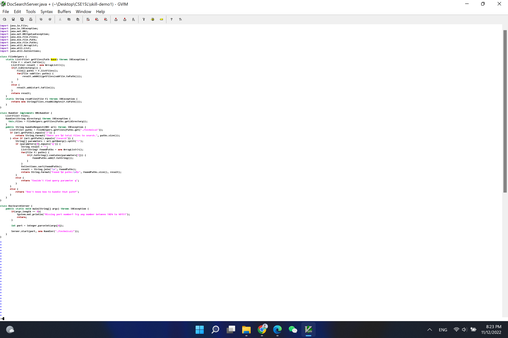

*Part 1*

    Vim TestDocSearch.java
    /start<Enter>cebase<Esc>:w<Enter>
    /start<Enter>cebase<Esc>:w<Enter>
    /start<Enter>cebase<Esc>:w<Enter>
    /start<Enter>cebase<Esc>:w<Enter>

step 1
type /start<Enter> to find the "start" and locate cursor on it

step 2
type ce base to delete the "start" and change it to "base"

step 3
press <Esc>:w to exit to normal mode and save the change

step 4
press <Enter> to excute the save and see the results saying that "saved successfully"

    
step 5
Since there are 4 occurences of the word "start", we need to repeat process above 4 times.

*Part 2*
Method 1: start in VS Code then scp

It took me about 2min 16s to do it. The difficulty is that running bash test.sh on the remote if a little bit confusing.

Method 2:

It took me about 1min 46s to do it. The difficulty is that I am not very familliar with using vim on the server.

*Which of these two styles would you prefer using if you had to work on a program that you were running remotely, and why?*

The second one is faster but I would choose the first method since I am get used to it and more familliar with the local commands.

*What about the project or task might factor into your decision one way or another? (If nothing would affect your decision, say so and why!)*

If there are numbers of projects need similar editting, I might prefer the second method, since scp so many times would be annoying. 
